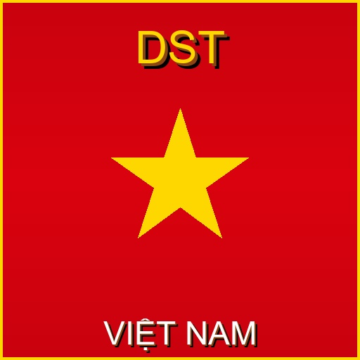

# [DST] Việt hoá Ultimate

<div align="center">
  
  
  **Mod Việt hoá toàn diện cho Don't Starve Together**
  
  [](https://github.com/fudio101)
  [](https://steamcommunity.com/sharedfiles/filedetails/?id=3510683755)
  [](https://store.steampowered.com/app/322330/Dont_Starve_Together/)
</div>

## 🌟 Tính năng chính

### 📝 **Việt hoá toàn diện**
- ✅ **Giao diện**: Tất cả menu, UI, text trong game
- ✅ **Hội thoại**: Dialogue của tất cả nhân vật
- ✅ **Mô tả**: Items, recipes, descriptions
- ✅ **Hệ thống**: Settings, notifications, tooltips

### 🎨 **Font tiếng Việt đẹp**
- ✅ **Hiển thị rõ ràng**: Font được tối ưu cho tiếng Việt
- ✅ **Đầy đủ dấu**: Hỗ trợ hoàn hảo các ký tự có dấu
- ✅ **Nhiều style**: Dialog, UI, chat, numbers...

### 🌳 **Skill Tree tiếng Việt**
- ✅ **Tất cả nhân vật**: Wilson, Willow, Wendy, Wortox, Wigfrid, Wolfgang, Woodie, Wormwood, Winona...
- ✅ **Skill descriptions**: Mô tả kỹ năng chi tiết
- ✅ **Unlock conditions**: Điều kiện mở khóa
- ✅ **Panel names**: Tên các panel skill

## 🔧 Cài đặt

### 🎮 **Steam Workshop**
1. Subscribe mod trên [Steam Workshop](https://steamcommunity.com/sharedfiles/filedetails/?id=3510683755)
2. Launch Don't Starve Together
3. Enable mod trong Mods menu
4. Restart game

### 📁 **Manual Install**
1. Download mod từ GitHub releases
2. Extract vào thư mục `mods` của DST
3. Enable trong game

## ⚙️ Cấu hình

### 🧔 **Wilson Beard Settings**

#### **Beard Insulation**
- `% Only`: Chỉ hiển thị % tăng cách nhiệt
- `% + Magnificent`: Hiển thị % + số liệu râu Magnificent
- `% + 3 Beard Stage`: Hiển thị % + cả 3 giai đoạn râu

#### **Beard Speed**
- `Không hiển thị`: Ẩn tốc độ mọc râu mặc định
- `Một phần`: Hiển thị 1 skill
- `Tất cả`: Hiển thị tất cả skills

## 🛠️ Kỹ thuật

### 📋 **Yêu cầu hệ thống**
- **Game**: Don't Starve Together (latest version)
- **Type**: Client-side mod
- **Multiplayer**: Compatible
- **Dependencies**: None

### 🔍 **Cấu trúc mod**
```
📦 [DST] Việt hoá Ultimate
├── 📄 modinfo.lua          # Mod metadata & config
├── 📄 modmain.lua          # Main mod logic  
├── 📄 vietnamese.po        # Translation strings
├── 📄 vietnamese.mo        # Compiled translations
├── 📁 fonts/               # Vietnamese fonts
├── 📁 scripts/
│   ├── 📄 font_helper.lua      # Font loading system
│   ├── 📄 fonts_list.lua       # Font list
│   └── 📄 skilltree_strings.lua # Skill tree translations
└── 📁 tools/               # Build tools
```

### 🎯 **Features**
- **Lightweight**: Optimized for performance
- **Clean code**: Well-structured and maintainable  
- **Auto font loading**: Dynamic font system
- **Config options**: Customizable experience

## 🤝 Đóng góp

### 🐛 **Báo lỗi**
- Tạo [Issue](https://github.com/fudio101/dst-vietnamese-ultimate/issues) với mô tả chi tiết
- Kèm screenshot nếu có thể
- Ghi rõ version game và mod

### 🌍 **Cải thiện bản dịch**
- Fork repository
- Chỉnh sửa `vietnamese.po`  
- Tạo Pull Request

### 💡 **Đề xuất tính năng**
- Mở [Discussion](https://github.com/fudio101/dst-vietnamese-ultimate/discussions)
- Mô tả tính năng muốn thêm

## 📜 Lịch sử phiên bản

### **v1.1.2** (Latest)
- ✅ Thêm thông tin đóng góp vào description modinfo
- ✅ Bổ sung link GitHub trong mod description
- ✅ Khuyến khích cộng đồng tham gia phát triển

### **v1.1.1**
- ✅ Thêm GitHub link vào modinfo
- ✅ Cập nhật Steam Workshop link mới
- ✅ Sửa lỗi hiển thị icon trong README

### **v1.1.0**
- ✅ Xóa Status Announcer (không ổn định)
- ✅ Loại bỏ config options không dùng
- ✅ Tối ưu hiệu suất
- ✅ Code cleanup

### **v1.0.0** 
- 🎉 Release đầu tiên
- ✅ Font tiếng Việt
- ✅ Translation system
- ✅ Skill tree localization

## 📄 License

MIT License - Xem [LICENSE](LICENSE) để biết thêm chi tiết.

## 🙏 Credits

- **Translation**: Shinosan & nqtonj (original mods)
- **Fonts**: Vietnamese DST community
- **Merging & Optimization**: fudio101
- **Testing**: Vietnamese DST players

---

<div align="center">
  <sub>Made with ❤️ for Vietnamese Don't Starve Together community</sub>
</div> 